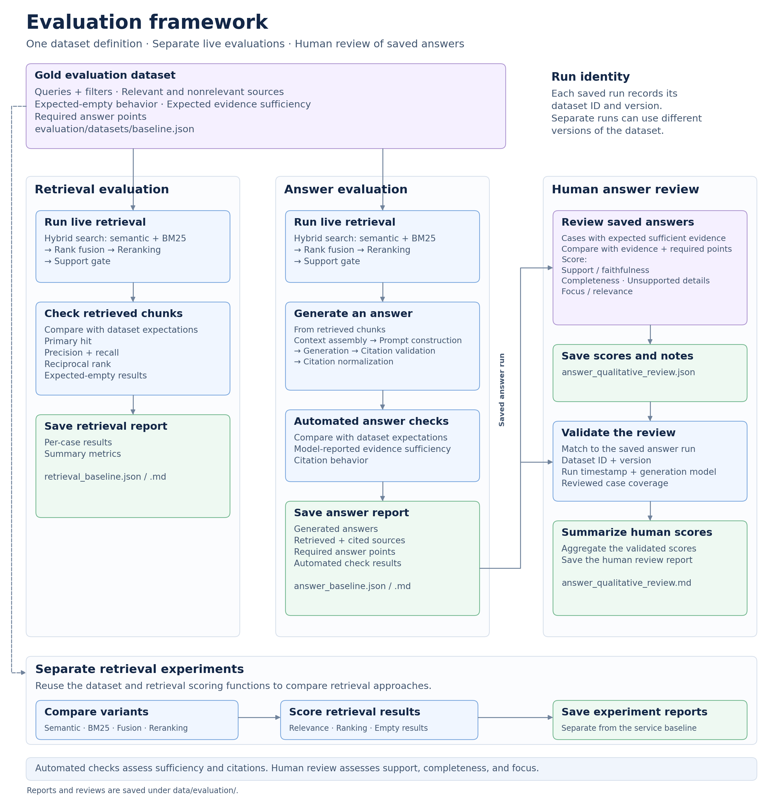

The Python RAG Service evaluates retrieval and answer generation from one versioned dataset. Two commands run that
dataset against the live service and save separate reports. A person then reviews the saved answers. Retrieval
experiments can reuse the same dataset, and their reports stay outside those baseline runs.

[How evaluation works](/docs/evaluate/how-evaluation-works) explains what those checks measure.
[Evaluation framework reference](/docs/reference/evaluation-framework-reference) lists the dataset, report, and
review fields.

The evaluation architecture diagram shows that structure. One dataset feeds retrieval evaluation and answer
evaluation. Answer evaluation saves the run that human review checks. The dashed line shows retrieval experiments
reading the same dataset without replacing the baseline reports.

<Frame caption="Python RAG Service evaluation architecture">
  
</Frame>

## The shared dataset

Both live evaluations load `evaluation/datasets/baseline.json`. The file is one versioned dataset. Each test case
has a query, optional filters, retrieval expectations, and, in the current dataset, an answer expectation.

The retrieval expectation names relevant and nonrelevant sources and sets `expect_empty`. The answer expectation
sets `expected_sufficient_evidence` and lists required points for human review. Reports copy the dataset ID and
version, so a later run can use a different version of the same file.

## Retrieval evaluation

`rag_service.commands.evaluate_retrieval` runs the production retrieval pipeline for every case. That pipeline is
vector retrieval, BM25 retrieval, reciprocal rank fusion (RRF), reranking, and the support gate. The command
requests 5 chunks and passes the case filters.

It then compares those chunks with the case's retrieval expectation. The comparison records primary-source hits,
precision, recall, reciprocal rank, and whether an expected-empty case returned no chunks. The command writes
`data/evaluation/retrieval_baseline.json` and `data/evaluation/retrieval_baseline.md`.

[Retrieval evaluation](/docs/evaluate/retrieval-evaluation) defines those metrics and the case success rule.

## Answer evaluation

`rag_service.commands.evaluate_answers` starts with the same retrieval call. It then generates an answer from the
retrieved chunks. Generation includes context assembly, the grounded prompt, the model response, citation
validation, and citation normalization. The application validates citations. The evaluation command compares the
finished answer with the case.

The automated checks compare evidence sufficiency and citation behavior with the answer expectation. They store
the required points and don't score whether the prose covers them. The command writes
`data/evaluation/answer_baseline.json` and `data/evaluation/answer_baseline.md`. That JSON file is the saved answer
run.

[Answer evaluation](/docs/evaluate/answer-evaluation) defines the structural checks.

## Why the two evaluations stay separate

Retrieval evaluation and answer evaluation share the dataset and measure different failures. A retrieval report can
fail a case when the top chunks miss a required source, while the answer report for that same case still passes.
Valid citations can also accompany an answer that drifts off the question. Separate reports keep those failures
visible.

[How evaluation works](/docs/evaluate/how-evaluation-works) shows the cases behind that split.

## Expected-empty cases

An expected-empty case sets `expect_empty` to `true` and lists no relevant sources. The current dataset pairs that
flag with `expected_sufficient_evidence` set to `false`. The dataset model doesn't require the two fields to match.

The retrieval command sends the case through the production pipeline, including the support gate. The case passes
when that call returns no chunks. The answer command generates from those chunks and checks that the answer reports
insufficient evidence and includes no citations.

[Retrieval pipeline](/docs/architecture/retrieval-pipeline) explains the support gate.

## Human review

A person reviews the saved answers for cases that expect sufficient evidence. The review scores support and
faithfulness, required-point completeness, unsupported details, and focus. The reviewer stores the scores and
notes in `data/evaluation/answer_qualitative_review.json`.

`rag_service.commands.report_qualitative_answers` doesn't score the answers. It checks that the review names the
saved answer run, then writes `data/evaluation/answer_qualitative_review.md`. The check compares dataset ID, dataset
version, the answer report's `generated_at` timestamp, and the generation model. The reviewed case IDs must be
exactly the cases whose `expected_sufficient_evidence` is `true`.

[Answer evaluation](/docs/evaluate/answer-evaluation) defines how to apply the four scores.

## Retrieval experiments

These commands try retrieval setups other than the production pipeline. They use the same dataset and the same
retrieval scoring function. Each one writes its own JSON and Markdown files under `data/evaluation/`. Those files
aren't `retrieval_baseline` or `answer_baseline`, and human review doesn't match them.

- `evaluate_bm25` retrieves with BM25 only and keeps the top five matches.
- `evaluate_hybrid` runs vector retrieval and BM25 retrieval, then combines the two ranked lists with reciprocal
  rank fusion. It doesn't rerank that combined list.
- `evaluate_reranking` takes vector-retrieval candidates, reranks them, and keeps the top five.
- `evaluate_hybrid_reranking` combines vector and BM25 results, reranks that list, and then applies a provisional
  support cutoff of `0.70`.

`evaluate_bm25`, `evaluate_hybrid`, and `evaluate_reranking` don't apply a support cutoff, so they don't score
whether an expected-empty case returned no chunks. The production retrieval command does, because it runs the
service's support gate.

## Saved artifacts

Each baseline report records the dataset ID, dataset version, generation time, Qdrant collection, and the models
and retrieval settings used for that run. Separate runs can use different dataset versions. Compare runs that share
the same version.

The commands write reports and reviews under `data/evaluation/`. Git ignores `/data/`, so those files stay on the
machine that ran the command. [Evaluation framework reference](/docs/reference/evaluation-framework-reference) lists
the fields in each file.

## Next steps

**[Run the evaluation](/docs/evaluate/run-the-evaluation)**: Produce a retrieval run, an answer run, or the
qualitative report.

## Related pages

- **[Retrieval evaluation](/docs/evaluate/retrieval-evaluation)**: Look up retrieval metrics and the case success rule.
- **[Answer evaluation](/docs/evaluate/answer-evaluation)**: Look up the structural checks and the qualitative scores.
- **[Current evaluation results](/docs/evaluate/current-evaluation-results)**: Read the recorded results for the current dataset version.
- **[How evaluation works](/docs/evaluate/how-evaluation-works)**: See what the dataset measures and why the checks stay separate.
- **[Evaluation framework reference](/docs/reference/evaluation-framework-reference)**: Look up the dataset, report, and human-review fields for this architecture.
