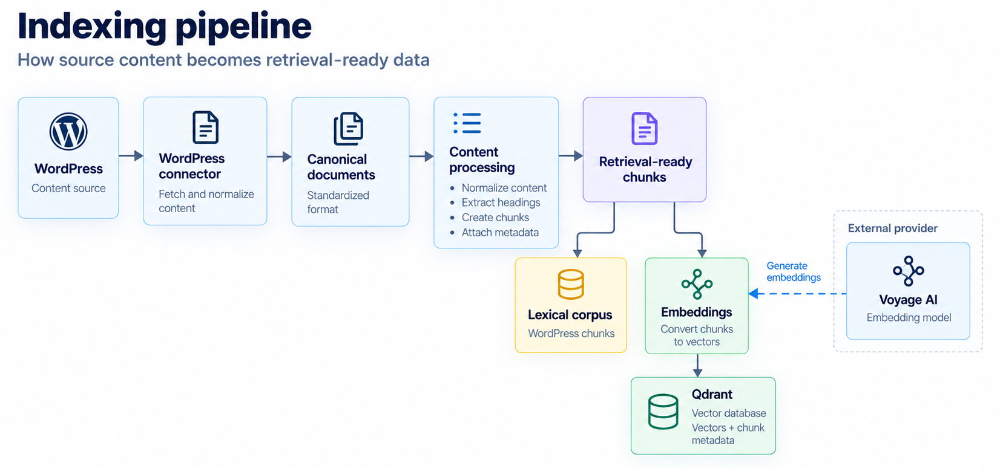

The indexing pipeline turns WordPress source content into the data searched during retrieval. It runs through the
`index_wordpress` command, separate from the public API.

[System architecture](/docs/architecture/system-architecture) shows where this pipeline sits among retrieval, answer
generation, and the API. This page follows source content through connector retrieval, canonical mapping, content
processing, embeddings, and storage, and explains what a full rebuild changes compared with an incremental run.

The indexing pipeline diagram shows that path. The same retrieval-ready chunks feed two stores. The lexical corpus
keeps the chunk text for BM25 retrieval, while Qdrant stores a Voyage embedding for each chunk with its metadata.

<Frame caption="Python RAG Service indexing pipeline">
  
</Frame>

## WordPress connector

The WordPress connector is the ingestion boundary of the indexing pipeline. It calls the WordPress REST API and
retrieves the published records in the configured collections (`posts`, `pages`, and other custom post types you define).
It maps each record into a canonical document, the platform-neutral model later stages read.

A canonical document carries a document ID, the source, the source ID, the title, the URL, the body, the content type,
and metadata the connector preserved. The document ID is built from the WordPress type and ID, such as
`wordpress:page:15`, so the same source record keeps the same ID across runs.

The mapper records standard WordPress fields, including the immediate parent page when one exists. A connector profile
adds site-specific fields, HTML blocks that must stay intact, and headings whose sections stay out of the index.

A record with no body isn't indexable, so content processing doesn't chunk it. A page with no body is also mapped as
a landing document.

The connector reads source content for indexing. The WordPress client is a separate component that sends search and
answer requests to the public API.

## Content processing

Content processing turns indexable canonical documents into retrieval-ready chunks. It runs on documents whose role
is `content` and whose `indexable` flag is true.

Normalization runs first. It removes scripts, styles, comments, and empty headings and paragraphs from the document
HTML. The pipeline then builds heading sections and drops any section whose heading path includes a heading the
connector profile excludes.

Chunking splits the remaining sections into chunks with a limit of 2,000 characters. Each chunk stays inside one
heading section. Lists, code, quotes, tables, and preserved HTML blocks stay intact, including when one of those
blocks is longer than the limit.

Each chunk keeps the document title, URL, content type, heading path, and anchor, plus metadata copied from the
canonical document. The chunk ID is derived from the document ID, heading path, and chunk text. Unchanged chunk
content under the same heading keeps the same ID across runs.

## Embeddings and storage

The indexing command writes the current canonical documents to `data/wordpress-documents.json`. That file is the
snapshot the next run compares against. WordPress remains the source of truth. The snapshot is the last successfully
indexed view of those documents.

It also writes the current retrieval-ready chunks to `data/wordpress-chunks.json`. That file is the lexical corpus.
It includes chunks from unchanged documents, because the file is the full corpus BM25 retrieval reads later. It
omits documents that content processing skipped.

Voyage generates an embedding for each chunk that the run stores in Qdrant. Qdrant keeps that vector with
the chunk metadata. Query embeddings are created later, during retrieval, and aren't part of indexing.

The command generates those embeddings before it deletes or replaces Qdrant records. A Voyage failure leaves the
existing vector records in place. The command writes the document snapshot and the chunk file after vector
synchronization returns. If Voyage or Qdrant fails, both files stay as they were, and the next run can retry the
same changes.

## Full and incremental indexing

Each indexing run fetches the current published documents and compares them with the snapshot from the last
successful run. The comparison uses the whole canonical document:

| | Incremental indexing | Full rebuild |
|---|---|---|
| **Documents embedded** | New and updated | All current documents |
| **Unchanged vectors** | Left in place | Re-embedded and replaced |
| **Removed documents** | Deleted from Qdrant | Deleted from Qdrant |
| **Lexical corpus** | Rewritten with all current chunks | Rewritten with all current chunks |
| **Use when** | Source content changes | Embedding, chunking, or vector-metadata behavior changes |

### Incremental run

Without `--rebuild-vector-index`, the command updates Qdrant from that comparison. It embeds and stores chunks for
new and updated documents. For an updated document, it replaces that document's previous Qdrant points with the
current chunks. It deletes Qdrant points for removed documents. It doesn't send unchanged documents to Voyage or
rewrite them in Qdrant.

The lexical corpus file is still rewritten with the full current chunk set, so unchanged documents remain available
to BM25 retrieval.

[Re-index and update content](/docs/index-content/re-index-and-update-content) is the procedure for this run.

### Full rebuild

`--rebuild-vector-index` re-embeds every current document and replaces its Qdrant points, including documents that
match the snapshot. Use a full rebuild for the first index, and again after a change to the embedding model,
embedding dimension, chunking rules, or the metadata stored with each vector.

[Index WordPress content](/docs/index-content/index-wordpress-content) is the procedure for that first build.

## Next steps

**[Retrieval pipeline](/docs/architecture/retrieval-pipeline)**: See how search uses the Qdrant records and the
lexical corpus this pipeline writes.

## Related pages

- **[Index WordPress content](/docs/index-content/index-wordpress-content)**: Run the first full index and confirm the
  stored artifacts.
- **[Re-index and update content](/docs/index-content/re-index-and-update-content)**: Update an existing index when
  WordPress content changes, and see when a rebuild is required.
- **[Tutorial: Build and inspect your first documentation index](/docs/index-content/build-your-first-documentation-index)**:
  Follow one indexing run and inspect the documents, chunks, and vectors it produces.
- **[System architecture](/docs/architecture/system-architecture)**: See how the indexing pipeline fits with
  retrieval, answer generation, and the public API.
