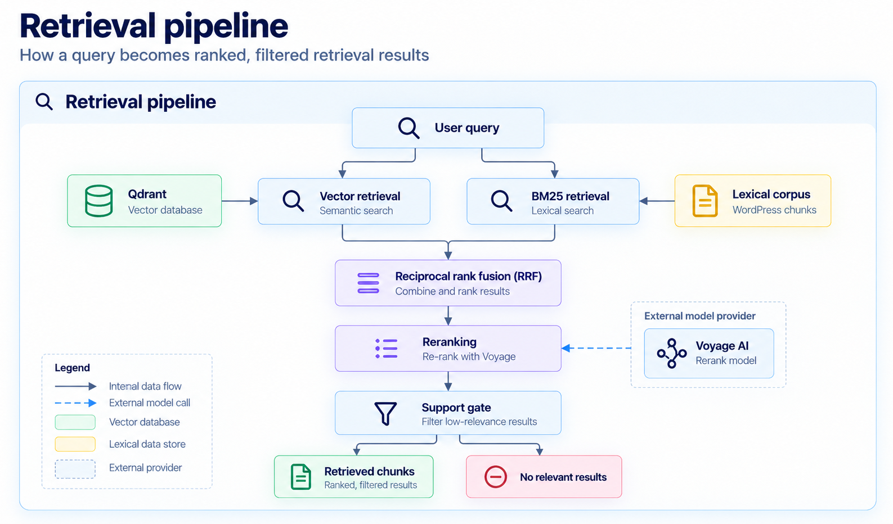

The retrieval pipeline selects the chunks a query can use. `POST /v1/search` and `POST /v1/answer` both call this
same hybrid retrieval pipeline. Search returns the chunks as search results. The answer route passes them to answer
generation.

[System architecture](/docs/architecture/system-architecture) shows where retrieval sits. This page follows one query
through vector retrieval, BM25 retrieval, reciprocal rank fusion, reranking, and the support gate, including why an
unsupported query can come back with no chunks.

The retrieval pipeline diagram shows the main retrieval stages. Vector retrieval includes query embedding and Qdrant search;
the dashed arrow shows the separate Voyage reranking call.

<Frame caption="Python RAG Service retrieval pipeline">
  
</Frame>

## Why the pipeline uses hybrid retrieval

Vector retrieval and BM25 lexical retrieval look for relevant chunks in different ways.

Vector retrieval compares a Voyage embedding of the query with the chunk embeddings in Qdrant. It can find a chunk
that uses different words for the same idea.

BM25 retrieval matches terms in the query against the lexical corpus. BM25 retrieval matches terms in the query against the
lexical corpus. It's useful when shared terms, names, identifiers, or other specific wording help identify the right documentation.

The retrieval pipeline keeps both lists. A chunk that one method misses can still appear in the other. That
combination is hybrid retrieval: one pipeline with two candidate lists.

## Vector and BM25 candidates

The retrieval service checks the request before it searches. It rejects a blank query, a limit below 1, or a filter
it doesn't support. Supported filters are `document_id`, `source`, `source_id`, and `content_type`. Each filter is a
non-empty string or a list of non-empty strings. The same filters are applied to both searches.

Vector retrieval embeds the query with Voyage and searches Qdrant. BM25 retrieval searches an in-memory index built
from the lexical corpus, `data/wordpress-chunks.json`, when the retrieval service starts.
[Indexing pipeline](/docs/architecture/indexing-pipeline) explains how those two stores are written.

Each search returns its own ranked list of candidate chunks. By default, vector retrieval keeps up to 20 candidates
and BM25 retrieval keeps up to 20. The service then removes duplicate chunk IDs within each list and keeps the first
occurrence. At this point the two rankings are still separate. A vector score and a BM25 score aren't one shared
scale.

## Reciprocal rank fusion

Reciprocal rank fusion (RRF) combines the two candidate lists by rank. For each list, a candidate at rank `r`
contributes `1 / (k + r)`. The default `k` is 60. A chunk that appears in both lists receives both contributions, so
agreement between vector and BM25 retrieval raises its fused rank.

RRF doesn't require the two methods to produce comparable scores. It uses position in each list. The pipeline keeps
the top fused candidates. The default depth is 20. If fusion produces no candidates, the service returns no chunks
and doesn't call the reranker.

## Reranking

The Voyage reranker, `rerank-2.5` by default, scores the fused candidates against the query. Each candidate is sent
as its title, heading path, and chunk text. The reranker returns a new order and a new score for the candidates it
keeps, up to the limit the caller requested.

Reranking is a closer comparison than the first-stage rankings. It reorders the short fused list. Those reranked
chunks are still candidates until the support gate accepts them.

## Support gate

The support gate decides whether the reranked chunks support returning results for the query. It compares the top
rerank score with the configured support cutoff. The default cutoff is `0.70`. If that top score is below the
cutoff, or the reranker returns no chunks, the service returns no chunks.

The cutoff applies to the query as a whole, not to every returned chunk. If the top reranked result meets the cutoff,
the service can return the remaining reranked results up to the requested limit even when their individual scores are
below 0.70.

### Why unsupported queries return no results

Vector retrieval and BM25 retrieval return the closest chunks they can find, including when the indexed
documentation doesn't contain an answer to the query. Those chunks can be relevant to the topic and still fail to
support the question. Evaluation on the current corpus and models showed that a cutoff on raw vector similarity, or
on the BM25 score, wasn't a reliable way to make that decision. The pipeline uses the top Voyage rerank score
instead.

The `0.70` cutoff was selected for that corpus and those models. A change to the corpus, embedding model, reranking
model, chunking strategy, or retrieval configuration is a reason to evaluate the cutoff again.
[Retrieval evaluation](/docs/evaluate/retrieval-evaluation) is where that measurement is defined.

Returning no chunks is a completed retrieval decision. `POST /v1/search` then responds with no relevant results. If
query embedding, vector search, lexical retrieval, or reranking can't complete, retrieval fails rather than returning
an empty result list.

When the top score meets the cutoff, the service returns the reranked chunks up to the requested limit. Those are
the retrieved chunks. Search returns them as search results. `POST /v1/answer` requests 5 chunks from this same
pipeline and passes that list to answer generation.

## Next steps

**[Answer generation and citations](/docs/architecture/answer-generation-and-citations)**: See how retrieved chunks
become the context for a grounded answer.

## Related pages

- **[Search documentation](/docs/search-and-answer/search-documentation)**: Call this pipeline through `POST /v1/search`.
- **[Retrieval evaluation](/docs/evaluate/retrieval-evaluation)**: See how retrieval quality is measured, including
  expected-empty queries.
- **[Current evaluation results](/docs/evaluate/current-evaluation-results)**: Review the recorded results for this
  pipeline.
- **[System architecture](/docs/architecture/system-architecture)**: See where the retrieval service sits among
  indexing, answer generation, and the public API.
- **[Indexing pipeline](/docs/architecture/indexing-pipeline)**: See how Qdrant and the lexical corpus are built
  before a query arrives.
