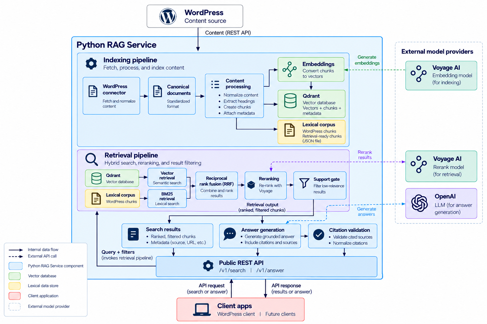

The Python RAG Service indexes documentation, retrieves relevant chunks, and generates grounded answers. This page
explains the major components, the boundaries between them, and how content and requests move through the system.

WordPress is the first content source and the first client. Indexing, retrieval, and answer generation work from a
platform-neutral document model, so another content source or client can use the same core later.

The system architecture diagram shows the two main flows through the system. Indexing writes retrieval-ready data. A later search or
answer request reads that data. An answer request also calls a language model. Solid arrows stay inside the service or
between the service and a client. Dashed arrows are calls to Voyage AI or OpenAI.

<Frame caption="Python RAG Service system architecture">
  
</Frame>

## Content flow and request flow

Content and requests take different paths through the system, meeting at the
retrieval index.

During indexing, the WordPress connector maps source content into canonical
documents. Content processing turns those documents into chunks, which are stored
for vector and lexical retrieval.

A request starts at the public API. `POST /v1/search` and `POST /v1/answer` both
use the same retrieval service. Search returns the retrieved chunks as results, while
answer passes those chunks to answer generation, which calls the language model
and validates citations before the API returns the response.

The WordPress reference client keeps that request path on the server. The browser
calls WordPress, and WordPress forwards the request to the public API.

## Indexing pipeline

The indexing pipeline turns source documentation into the data used by retrieval.
[Indexing pipeline](/docs/architecture/indexing-pipeline) explains the stages in
more detail.

The WordPress connector retrieves configured content and maps each source record
into the service's canonical document model. Content processing then normalizes
the document, preserves its heading structure, splits it into chunks, and attaches
retrieval metadata.

Those chunks are stored in two forms:

- **Qdrant** stores vector embeddings and chunk metadata for vector retrieval.
- The **lexical corpus** stores the same chunks as text for BM25 retrieval.

Because both stores are produced from the same canonical chunks, the retrieval
service can combine vector and lexical retrieval without depending on WordPress
response formats.

The WordPress connector handles source ingestion. The WordPress client is a
separate component that sends search and answer requests through the public API.

## Retrieval service

The retrieval service is the shared retrieval pipeline behind `POST /v1/search` and
`POST /v1/answer`. [Retrieval pipeline](/docs/architecture/retrieval-pipeline)
explains the stages in more detail.

It searches Qdrant and the lexical corpus for the query, then returns the selected
chunks. When the indexed documentation doesn't support the query, it returns no
chunks.

Search returns those chunks as search results. The answer route passes the same
chunks to answer generation.

## Answer generation

Answer generation turns retrieved chunks into the answer the API returns.
[Answer generation and citations](/docs/architecture/answer-generation-and-citations)
explains the workflow in more detail.

It receives chunks from retrieval and sends that context to the language model.
The model proposes an answer and citations. The application validates those
citations against the retrieved chunks, then the API returns the answer and its
sources.

When retrieval returns no chunks, the answer route still calls answer generation.
The response reports whether the evidence was sufficient.

## Public API

The public API is the request boundary. FastAPI exposes three routes:

- `POST /v1/search` runs hybrid retrieval and returns search results.
- `POST /v1/answer` runs the same retrieval with retrieval limit of 5 chunks, then performs answer generation
and citation validation.
- `GET /health` reports whether the service process is responding. It doesn't check Qdrant, Voyage, or OpenAI.

Search and answer require an `X-API-Key` header. The health route is unauthenticated. Indexing stays on the
`index_wordpress` command, so publishing or updating the index is separate from the public request surface.

The API turns retrieval and answer-generation failures into its own error responses. Search returns
`retrieval_unavailable` when retrieval can't complete. The answer route returns `answer_unavailable` when retrieval,
the language model, the context budget, or citation validation fails. Both responses use a fixed public message.

## WordPress client

The WordPress client is a reference client for the public API. It provides Search and Ask interfaces to site visitors
while keeping communication with the RAG service on the server. See
[Integrate with WordPress](/docs/integrate/integrate-with-wordpress) to configure and connect the reference client.

The browser sends search and answer requests to WordPress REST endpoints provided
by the plugin. WordPress then forwards those requests to `POST /v1/search` or
`POST /v1/answer` and adds the `X-API-Key` header. The service URL and API key
remain on the WordPress server rather than being exposed to the browser.

The client renders search results, grounded answers, source links, and citations
from the API response. Retrieval, reranking, and answer generation remain
responsibilities of the RAG service.

Other applications can use the same public API without WordPress. The plugin is
one example of a client built on that boundary.

## What each component owns

The sections on this page follow content and requests through the system. This table names the components responsible for each part of that work.

| Component | Owns |
|---|---|
| **WordPress connector** | Retrieving WordPress content and mapping source-specific data into canonical documents. |
| **Indexing pipeline** | Turning canonical documents into retrieval-ready chunks, embeddings, vector records, and lexical data. |
| **Retrieval service** | Vector and lexical retrieval, ranking, reranking, filtering, and deciding whether retrieved content adequately supports the query. |
| **Answer generation** | Building model context, generating answers, handling evidence sufficiency, and validating citations. |
| **Public API** | Exposing search, answer, and health endpoints; authentication; request validation; and public error responses. |
| **WordPress client** | Sending search and answer requests from WordPress and rendering results, answers, links, and citations for users. |
| **External providers** | Supplying embeddings and reranking through Voyage AI, vector storage through Qdrant, and language-model generation through OpenAI. |

These boundaries keep source-specific and client-specific behavior outside the core retrieval and answer-generation logic.
Provider interfaces also let the service change embeddings, vector storage, reranking, or language-model implementations without
changing the responsibilities of the surrounding components.

## Next steps

**[Indexing pipeline](/docs/architecture/indexing-pipeline)**: Follow content from the WordPress connector through
chunking, embeddings, and the vector database.

## Related pages

- **[Integrate the RAG API into an application](/docs/integrate/integrate-rag-api-into-application)**: Call
  `POST /v1/search` and `POST /v1/answer` from a client other than the WordPress reference plugin.
- **[Integrate with WordPress](/docs/integrate/integrate-with-wordpress)**: Connect the WordPress reference client so
  the browser reaches the public API through the WordPress proxy.
